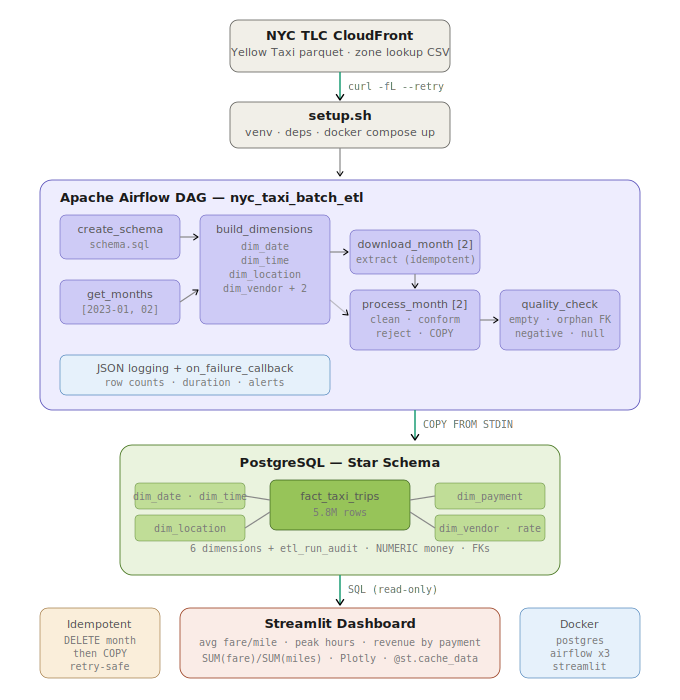
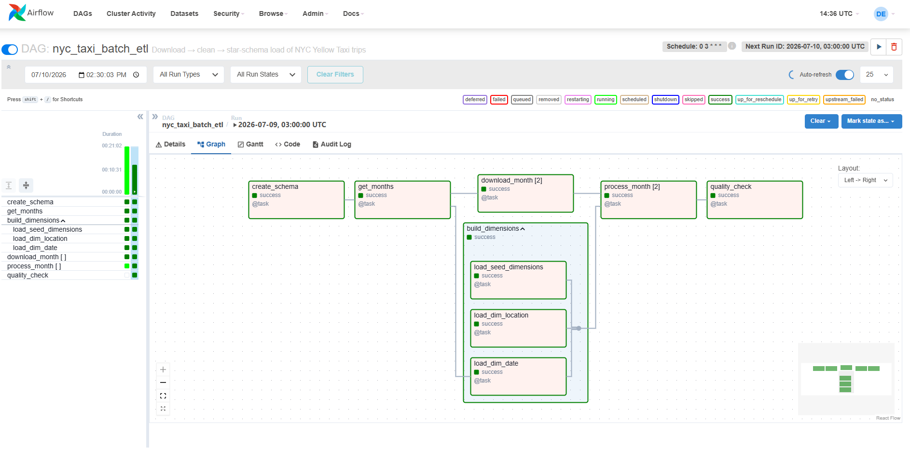
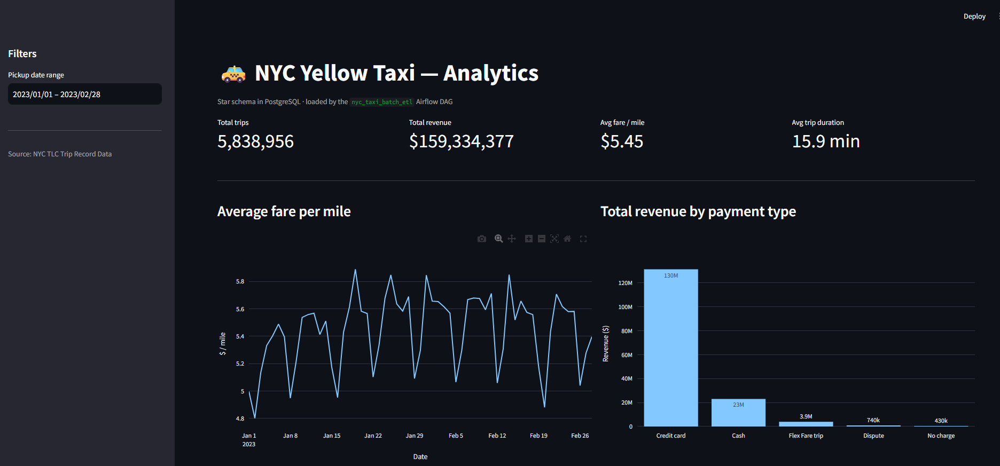
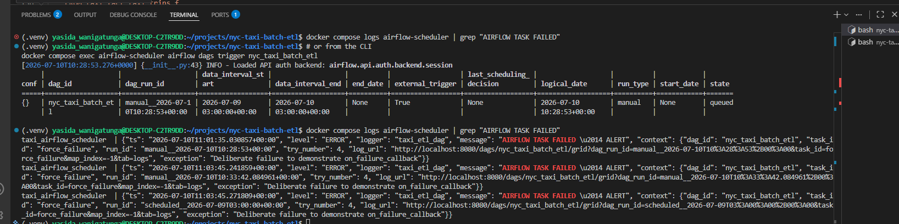
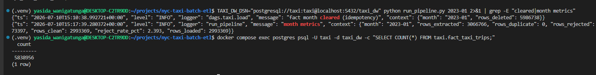

# NYC Yellow Taxi — Batch ETL

Automated batch pipeline: downloads NYC TLC Yellow Taxi trip records,
cleans them, loads a star schema into PostgreSQL, and serves business
metrics through a Streamlit dashboard. Orchestrated with Apache Airflow.

## Architecture



## Tech stack
| Layer | Technology |
|---|---|
| Scripting | Bash (`setup.sh`), Python 3.11 |
| Orchestration | Apache Airflow 2.9.3 (LocalExecutor) |
| Storage | PostgreSQL 16 (Docker) |
| Dashboard | Streamlit + Plotly |
| Infra | Docker Compose |

## Quick start

Requires Docker Desktop (≥ 6 GB RAM), `curl`, `python3`, and `git`.
On Windows 11, run everything inside WSL2 with Docker Desktop's WSL
integration enabled — see [Windows notes](#windows-11--wsl2) below.

```bash
git clone https://github.com/YasidaWanigatunga/nyc-taxi-batch-etl.git
cd nyc-taxi-batch-etl
chmod +x setup.sh
./setup.sh
```

`setup.sh` verifies the toolchain, writes `.env` with your host `AIRFLOW_UID`,
creates `.venv` and installs dependencies, `curl`s two months of trip data plus
the taxi-zone lookup into `data/raw/`, then brings up the full stack and waits
for health checks. It is idempotent — existing downloads are skipped.

| Service | URL | Credentials |
|---|---|---|
| Airflow | http://localhost:8080 | `admin` / `admin` |
| Streamlit | http://localhost:8501 | — |
| PostgreSQL | `localhost:5432` | db `taxi_dw`, user `taxi`, pw `taxi` |

### Load the data

The warehouse starts empty. In Airflow:

1. Un-pause **`nyc_taxi_batch_etl`** (toggle, left of the DAG name)
2. Click **▶ Trigger DAG**
3. Watch the **Graph** tab with **Auto-refresh** on

Roughly 20 minutes for both months (~5.8M trips). Or from the CLI:

```bash
docker compose exec airflow-scheduler airflow dags unpause nyc_taxi_batch_etl
docker compose exec airflow-scheduler airflow dags trigger nyc_taxi_batch_etl
```

Verify:

```bash
docker compose exec postgres psql -U taxi -d taxi_dw \
  -c "SELECT COUNT(*) FROM taxi.fact_taxi_trips;"
```

Expect `5838956`. Then refresh http://localhost:8501 — the dashboard populates.

### Running the business queries

```bash
docker compose exec -T postgres psql -U taxi -d taxi_dw < sql/analytics_queries.sql
```

### Everyday commands

```bash
docker compose ps                          # container health
docker compose logs -f airflow-scheduler   # follow structured JSON logs
docker compose exec postgres psql -U taxi -d taxi_dw   # SQL shell
docker compose down                        # stop, keep the data
docker compose down -v                     # stop and DESTROY the data volume
docker compose up -d                       # start again (no rebuild)
```

## Windows 11 / WSL2

```powershell
wsl --install -d Ubuntu    # PowerShell as Administrator, then reboot
```

1. Install Docker Desktop → Settings → Resources → **WSL Integration** → enable Ubuntu
2. Settings → Resources → **Memory: 6 GB minimum** (Airflow + Postgres + a 3M-row
   pandas DataFrame will OOM at 4 GB)
3. `sudo apt install -y python3-venv curl git`
4. Clone into `~/projects/`, **not** `/mnt/c/`. Bind-mounts across the
   Windows↔Linux boundary go through a translation layer and run 10–20× slower;
   reading a 50 MB parquet file goes from seconds to minutes.
5. `./setup.sh`

## Evidence

### Airflow DAG — successful run


`download_month [2]` and `process_month [2]` show **dynamic task mapping**: one
task instance per month, created at runtime from `get_months()`. Each month
retries independently. `build_dimensions` is a TaskGroup; the edge from it to
`process_month` is an ordering constraint with no data dependency — the fact
table's foreign keys require the dimensions to exist first.

### Streamlit dashboard


5,838,956 trips · $159,334,377 revenue · $5.45 average fare per mile.
Note **"Flex Fare trip"** in the payment-type chart: 71,743 rows per month with
`payment_type = 0`, undocumented in the TLC data dictionary. Conformed rather
than dropped — they carry $3.9M, ~2.5% of total revenue.

### Failure alerting (Task 4)


`on_failure_callback` fired after the final retry (`try_number: 4`), emitting a
structured ERROR log with `dag_id`, `task_id`, `run_id`, `log_url`, and the
exception. Verified by temporarily adding a task that raises, then removing it.

Airflow's **"Mark as Failed" does *not* trigger callbacks** — it writes metadata
state without executing the task. Tested, not assumed.

### Idempotency


`rows_deleted: 5,986,738` — exactly two copies of January's 2,993,369 rows.
An earlier run had duplicated the month (I triggered the DAG and the standalone
runner concurrently: two writers, one table). Re-running the load deleted the
entire January key range and re-inserted a single clean copy, restoring the
correct total of 5,838,956.

Delete-then-COPY is therefore not merely safe to retry — it is **self-repairing**.
It is atomic per transaction, not across processes. Airflow prevents concurrent
writers in practice (`max_active_runs=1`, no concurrent instances of a task), but
a hardened version would take a Postgres advisory lock keyed on the month.

## Star schema
**Grain: one row per completed taxi trip.**

`fact_taxi_trips` + six dimensions:

| Dimension | Key | Why |
|---|---|---|
| `dim_date` | `YYYYMMDD` | day/week/month roll-ups |
| `dim_time` | hour 0–23 | the *peak hours* query |
| `dim_location` | TLC LocationID | **role-playing**: joined twice (pickup + dropoff) |
| `dim_payment_type` | | *revenue by payment type* |
| `dim_vendor` | | vendor comparison |
| `dim_rate_code` | | airport vs standard fares |

`avg fare per mile` is **not** stored — it's a non-additive ratio,
computed at query time as `SUM(fare) / SUM(miles)`.

## Task mapping
| Task | Where |
|---|---|
| 1. Bash & setup | `setup.sh`, `docker-compose.yml`, `docker/` |
| 2. Data modeling | `sql/schema.sql` |
| 3. Python ETL & orchestration | `dags/taxi_etl_dag.py`, `dags/taxi/{extract,transform,load}.py` |
| 4. Monitoring & logging | `dags/taxi/logging_utils.py`, `alert_on_failure()`, `run_quality_checks()` |
| 5. SQL & dashboard | `sql/analytics_queries.sql`, `dashboard/app.py` |

## Design decisions & assumptions
Full data profile: [`notebooks/data_quality_findings.md`](notebooks/data_quality_findings.md)

1. **71,743 rows/month have `payment_type = 0`** — undocumented in the TLC
   dictionary — and the *same* rows carry all five null columns
   (`passenger_count`, `RatecodeID`, `store_and_fwd_flag`,
   `congestion_surcharge`, `airport_fee`). Verified: zero null
   `passenger_count` rows have `payment_type != 0`. Diagnosed as a separate
   source feed. **Conformed, not dropped** — they carry $3.9M, 2.5% of revenue.
2. **Impute when the measure is missing but the event is real; delete when
   the event itself is invalid.** Nulls → 1 passenger, $0 surcharge, rate
   code 99 = Unknown. Negative fares, zero-mile trips, >24 h durations → rejected.
3. **Outliers filtered on domain plausibility, not statistical distance.**
   σ(trip_distance) = 249 miles because the 258,928-mile outlier inflates the
   very statistic used to detect it. A 3σ rule would keep the garbage and
   delete legitimate airport runs. Cap: 200 miles.
4. **Duplicates: exact full-row only.** Measured: 0 exact, 165 business-key.
   Business-key dedup (vendor + pickup_ts + PULocationID) would delete
   legitimate concurrent trips — zones are areas, not points, and timestamps
   are second-resolution.
5. **Idempotency by delete-then-COPY.** `transform.py` filters pickups to
   inside the file's month, so `DELETE WHERE pickup_date_key IN <month>` is an
   exact, complete reload. Verified: reloading January twice leaves the row
   count unchanged at 5,838,956.
6. **`COPY FROM STDIN`, not `INSERT`/`to_sql`** — ~20x faster; streams in
   200k-row chunks so memory stays flat.
7. **`NUMERIC(10,2)` for money, never `FLOAT`.** Floats can't represent 0.10
   exactly; summing 5.8M of them drifts.
8. **`LocalExecutor`, not Celery.** Celery needs Redis and a worker fleet for
   no benefit on one laptop. The DAG code is executor-agnostic.
9. **One Postgres server, two databases** (`airflow`, `taxi_dw`) to keep the
   local footprint small. In production these would be separate instances.

## Cross-month validation
| Month | Extracted | Rejected | Reject % |
|---|---|---|---|
| 2023-01 | 3,066,766 | 73,397 | 2.393 |
| 2023-02 | 2,913,955 | 68,368 | 2.346 |

Reject rates agree to within 0.05% across two independent files: the rules
characterise the source feed, not one month's quirks. A large divergence in a
future month would signal an upstream schema change.

## Monitoring & observability
- **Structured JSON logging** (`JsonFormatter`): `ts`, `level`, `logger`,
  `message`, `context` — ready for Loki/ELK ingestion without regex parsing.
- **Stage timing**: `log_stage()` emits START/SUCCESS/FAILED with
  `duration_seconds`; every month logs `rows_extracted`, `rows_duplicate`,
  `rows_rejected`, `reject_rate_pct`, `rows_loaded`.
- **Failure alerting**: `on_failure_callback` in `default_args` fires for every
  task. Verified by temporarily adding a task that raises — the callback fired
  after the final retry with `try_number: 4`, emitting `dag_id`, `task_id`,
  `log_url`, and the exception.
  Note: Airflow's **"Mark as Failed" does *not* trigger callbacks** — it writes
  metadata state without executing the task. Tested, not assumed.
- **Retries**: 2, with exponential backoff. Safe precisely because the load is
  idempotent — a retry cannot duplicate data.
- **Quality gate**: `run_quality_checks()` fails the DAG on an empty fact
  table, orphan foreign keys, non-positive totals, or null date keys.

## Observed performance regression
| | First load (empty table) | After 5.8M rows + 4 indexes |
|---|---|---|
| `process_month` | 90 s | 476 s |
| `quality_check` | 19 s | 30 s |

Diagnosed from the `duration_seconds` field in the structured logs, not guessed.
Fixes, in order of preference:
1. Partition `fact_taxi_trips` by `RANGE (pickup_date_key)` — each month's COPY
   then touches only its own partition's indexes, and the idempotent DELETE
   becomes an O(1) `DROP PARTITION`.
2. Drop indexes before bulk load, `CREATE INDEX` after.
3. `SET session_replication_role = replica` to defer FK checks during load.

## What I'd do differently with more time
- `pytest` coverage for `clean_trips()` (assert a negative fare is rejected,
  a null `RatecodeID` maps to 99)
- dbt for the transformation layer, with `dbt test` assertions
- Great Expectations instead of hand-rolled quality checks
- Partition the fact table by month (see above)


## Cleaning strategy

**Principle:** impute when the measure is missing but the event is real; delete when the event itself is invalid.

**Duplicates:** no natural key exists in this dataset. Exact full-row duplicates are dropped.
Business-key dedup (vendor + pickup_ts +PULocationID) is rejected: zones are areas, not points, and timestamps are second-resolution,
so concurrent legitimate trips would collide.

**Outliers:** filtered on domain plausibility, not statistical distance.
σ(trip_distance) = 249 miles because the outlier inflates the statistic used
to detect it. A 3σ rule would fail.

**Validation:** three layers —
1. Schema: FK constraints reject bad keys at insert time
2. Load: post-load quality gate fails the DAG on empty/orphan/negative rows
3. Observability: reject_rate_pct persisted per run; drift signals upstream change